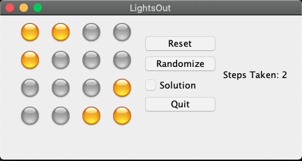
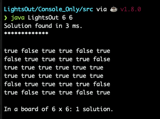

# Lights Out

An OOP implementation of the Lights Out logic game in java. 

The `PlayLightsOut` directory is an interactable game built with the Model-View-Controller design pattern.

The `SolutionsOnly` version is a non-interactable version that  displays the most efficient solution of a N x N LightsOut board in the terminal.

### To compile/run any of the versions:   

1) `cd SolutionsOnly` or `cd PlayLightsOut`

2) `cd src` && `javac *.java` 

3) `java LightsOut 4 4` (parameters can be changed)

| | | |
|:-------------------------:|:-------------------------:|:-------------------------:|
| |   |  

